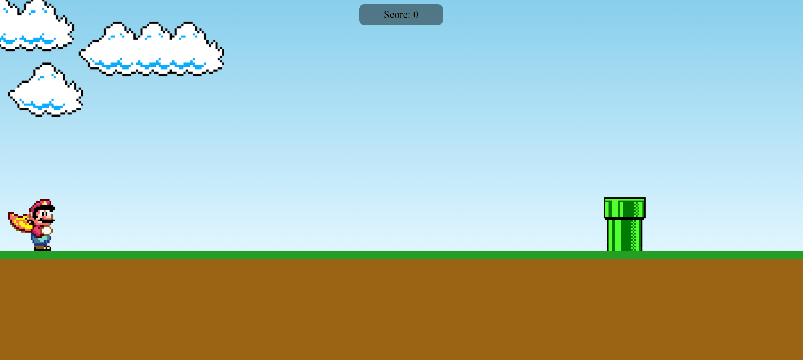
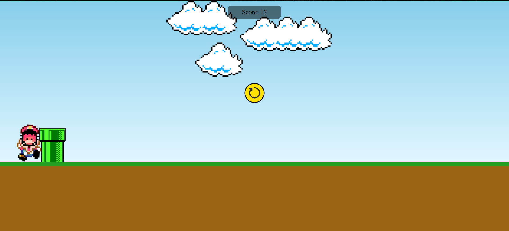

# 🎮 Projeto acadêmico:  Mini-Game do Mario
Este é um jogo simples inspirado no clássico Super Mario. O projeto é uma aplicação web que recria a experiência de um jogo de plataforma 2D, onde o personagem pode correr, pular e desviar de obstáculos.

> ⚠️ Este projeto é baseado em um vídeo tutorial disponível no YouTube, conforme os direitos autorais exigem (link ao final deste documento). **Todo o crédito pela ideia e estrutura base do projeto vai para o criador do vídeo.**

## Telas do game

### Tela inicial

### Tela game over

## Requisitos para rodar o projeto

> rodar o projeto localmente: 

- [Node.js](https://nodejs.org/) (De preferência versões mais atualizadas)
- [Git](https://git-scm.com/)
- Gerenciador de pacotes (npm ou yarn)
- Editor de código (opcional, como o [Visual Studio Code](https://code.visualstudio.com/))

## Funcionalidades

* Movimentação do personagem principal (correr e pular).

* Detecção de colisões com obstáculos.

* Reinício do jogo ao clicar no ícone de reiniciar após perder.

* Pontuação simples baseada no tempo de sobrevivência.

### 👩🏽‍💻 Tecnologia utilizadas

* HTML
* CSS
* JAVASCRIPT

#### Vídeo original usado de inspiração

👉 [Tutorial do jogo do Mário](https://www.youtube.com/watch?v=r9buAwVBDhA&t=1s)